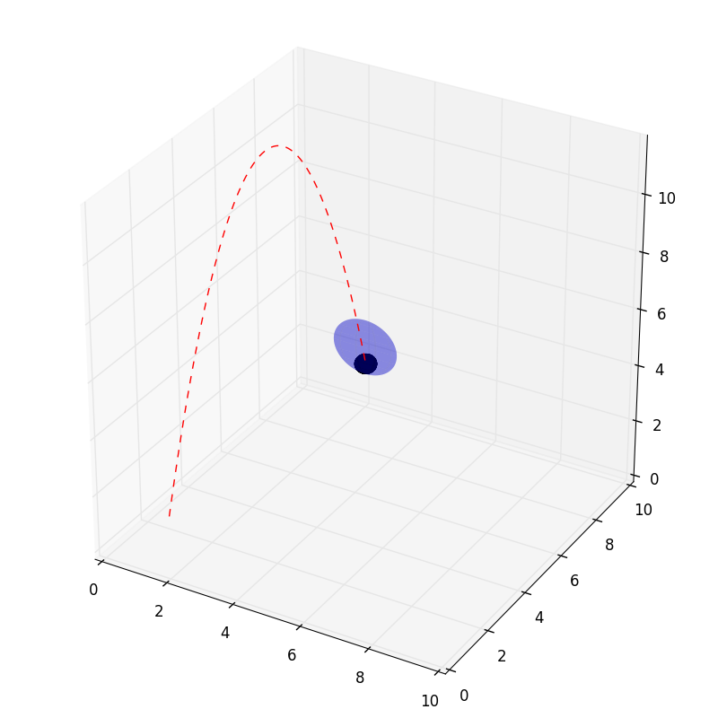

# Maddux
### Robot Arm and Simulation Environment

Created to use in a project for [Robert Platt's Robotics Course](http://www.ccs.neu.edu/home/rplatt/cs5335_2016/index.html)

#####  Features
- Arbitrary Length Arms
- Forward Kinematics
- Inverse Kinematics
- Simulation Environment (with objects like Balls and Targets)
- 3D Environment Animations

##### In Progress
- Inverse Velocity Kinematics
- 3D Arm Animations
- Learning/Control toolbox (Reinforcement Learning, Search)

### Arm Usage
```python
from maddux.robots.link import Link
from maddux.robots.arm import Arm

np.set_printoptions(suppress=True)

# Create a series of links (each link has one joint)
L1 = Link(0,0,0,1.571)
L2 = Link(0,0,0,-1.571)
L3 = Link(0,0.4318,0,-1.571)
L4 = Link(0,0,0,1.571)
L5 = Link(0,0.4318,0,1.571)
links = np.array([L1, L2, L3, L4, L5])

# Initial arm angle
q0 = np.array([0, 0, 0, np.pi/2, 0])
# Create arm
r = Arm(links, q0, '1-link')

# Calculate the jacobian
print r.jacob0([0, 0, 0, np.pi/2, 0])
```

	Generates: 
    [[ 0.00008795 -0.43180003  0.00008795  0.          0.        ]
     [ 0.43179999 -0.00008795  0.43179999 -0.00008795  0.        ]
     [ 0.          0.43179998  0.         -0.43179998  0.        ]
     [ 0.          0.         -0.         -0.          0.99999998]
     [-0.         -0.99999998 -0.          0.99999998 -0.00020367]
     [ 1.         -0.00020367  1.         -0.00020367  0.00000004]]


### Animation and Plotting Usage

```python
from maddux.environment import Environment
from maddux.objects import Ball, Target

ball = Ball([2, 0, 2], 0.25)
target = Target([2, 10, 2], 0.5)
environment = Environment(ball, target)

release_velocity = np.array([0, 15, 5])
ball.throw(release_velocity)

# Either run environment for n seconds
environment.run(2.0)
# And plot the result
environment.plot()

# Or, you can animate it while running
environment.animate(2.0)
```

An example of what the environment looks like plotted.



